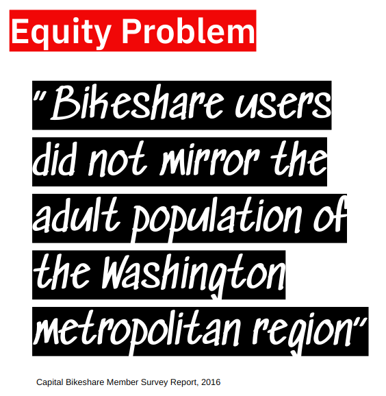
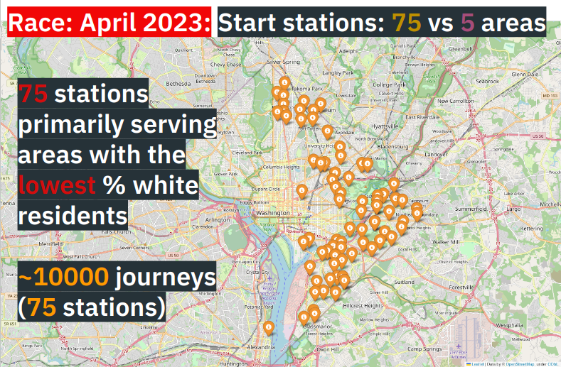
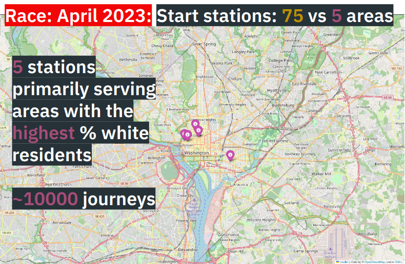

# Captial Bikeshare - Ridership equity

## Project Goals
* Assess performance on ridership diversity goals set by Captial Bikeshare (CB)
* Develop new KPIs and make predictions

Method: use geographical demographic information to cross-reference with journey start/end points

## About the data

### Trip Data 
Captial Bikeshare trip data for April 2023. The data includes:

```python
 #   Column              Non-Null Count   Dtype  
---  ------              --------------   -----  
 0   ride_id             389243 non-null  object 
 1   rideable_type       389243 non-null  object 
 2   started_at          389243 non-null  object 
 3   ended_at            389243 non-null  object 
 4   start_station_name  360858 non-null  object 
 5   start_station_id    360858 non-null  float64
 6   end_station_name    358630 non-null  object 
 7   end_station_id      358630 non-null  float64
 8   start_lat           389243 non-null  float64
 9   start_lng           389243 non-null  float64
 10  end_lat             388555 non-null  float64
 11  end_lng             388555 non-null  float64
 12  member_casual       389243 non-null  object 
```
Source: https://capitalbikeshare.com/system-data

Notes:
* Excludes staff testing trips, and any trips lasting less than 60 seconds (potentially false starts or ends).
* Dockless bikes and e-scooters (i.e., potentially without a namesstart or end station) are included after a certain point.

Cleaning:
* Exclude trip data outliers (improbable or impossible real-world conditions such as very long or negative durations)


### Demographic data
American Community Survey (ACS) 2022. Processing steps:
* Extract census tracts within DC, exclude census tracts with under 1200 population as non-residental and/or tourist areas
* Find the proportion of white (‘Race: One Race: White’) residents per census tract

### Combine data
* Find the two bikeshare stations closest to the center of each tract
* Compare trip data from stations serving areas with the highest and lowest proportion of white residents
* Adjust data to allow comparison between the two groups studied (to capture 10,000 rides it took 5 stations in areas with the highest proportions of white residents, whereas it took 75 stations in areas with the lowest proportions)


## Findings
* Fewer trips to and from stations not in predominantly white areas
* Fewer stations
* Shorter trip durations (inferred from net km)
* Few changes in marketing/public information policy despite research into demographic reach

## Recommendations
* Extend use of regression model with feature importance investigation to predict where new stations will have most impact.
* A/B testing of marketing/public information strategies based on new combined dataset
* Resume user monitoring